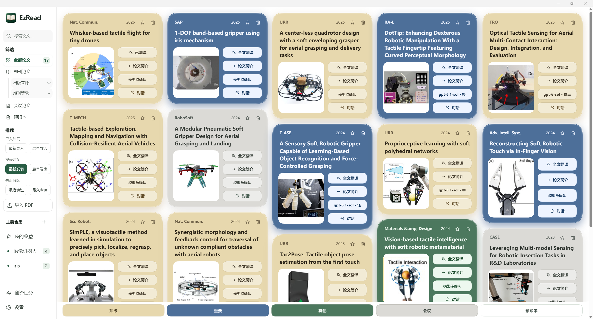
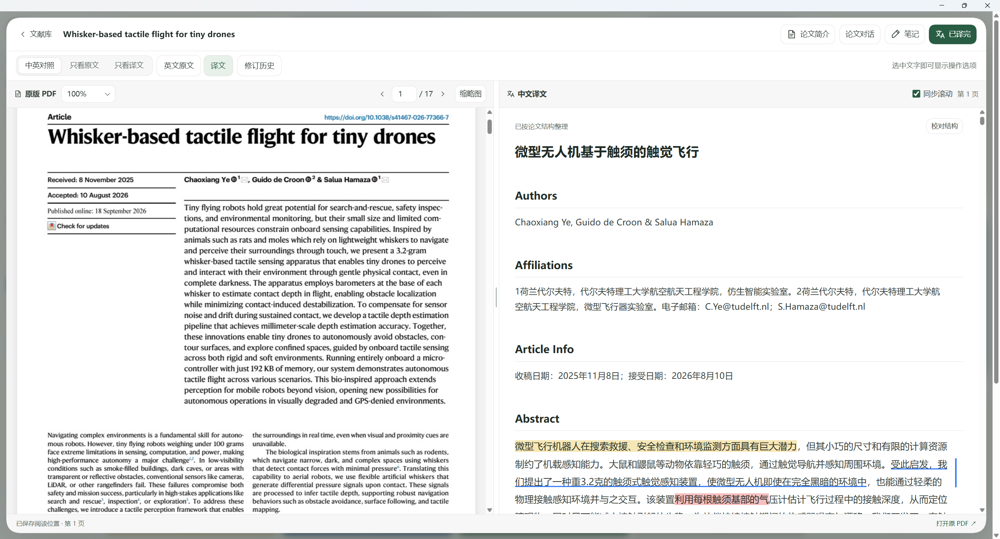
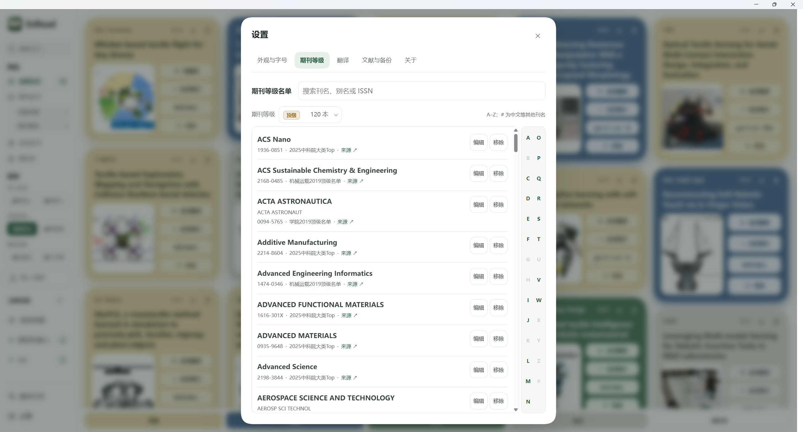
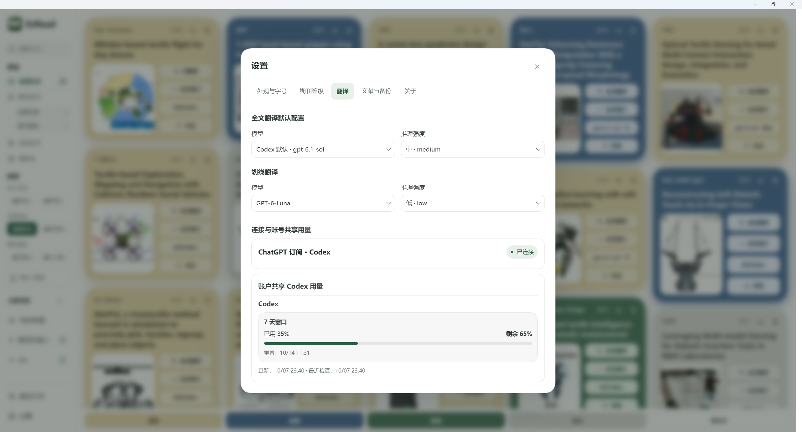

# EzRead

**一款简洁美观的 Windows 论文阅读软件。**

用自己的 Codex 额度翻译论文、与论文对话，也可以用 Codex 按自己的阅读习惯继续改造它。

## 五个亮点

- **简洁美观的界面**：圆润卡片、柔和配色与简洁布局，提供纸白、浅绿、石墨三种主题，把阅读体验带到 Windows 桌面。
- **沿用你的 Codex 额度**：通过本机官方 Codex CLI，使用你自己的 ChatGPT 账号进行论文翻译与对话，无需另配翻译 API Key；与该账号的其他 Codex 使用共用额度。
- **满足极简的论文阅读需求**：导入 PDF、对照阅读、翻译、提问、批注和笔记，让日常读论文的主要操作集中在一个窗口里。
- **自动识别与期刊分级**：导入文献时自动识别出版信息，依据按北京理工大学宇航学院期刊等级划分标准整理的内置名单，匹配“顶级、重要、其他”期刊类别，并通过卡片颜色区分；会议与预印本单独归类。名单依据与适用范围见[期刊等级说明](JOURNAL_TIERS.md)。
- **面向 AI Agent 的可修改架构**：按功能划分代码模块，提供协作约定、架构文档与检查入口，方便 Codex 定位代码、验证修改，用 vibe coding 增加你需要的功能。

## 界面预览

### 文献库



### 对照阅读



### 期刊等级



### 翻译设置



## 开始使用

目前采用源码运行方式，主要面向 Windows。准备好可使用 Codex 的账号，并在本机安装、登录 Codex。桌面端入口可参考 [OpenAI 官方说明](https://learn.chatgpt.com/docs/app)。

1. 点击[下载源码 ZIP](https://github.com/zhuangcao136-glitch/EzRead/archive/refs/heads/main.zip)，或在仓库首页选择 **Code → Download ZIP**。
2. 将 ZIP 解压到希望长期存放软件的位置，例如 `D:\Apps\EzRead`。打开 Codex，新建或添加本地项目，选择解压后包含 `README.md` 和 `AGENTS.md` 的文件夹。
3. 在该项目中新建对话，复制并发送下面这段话：

```text
请阅读当前文件夹中的 AGENTS.md 和 README.md，将 EzRead 适配到本电脑，检查并配置运行所需依赖，构建桌面组件，检查官方 Codex CLI 是否可用及其 ChatGPT 登录状态；需要我登录时告诉我。完成后创建桌面快捷方式，启动软件并验证窗口能够正常打开。不要导入真实论文或发起全文翻译、论文问答来测试安装。
```

4. 按 Codex 的提示完成必要的安装与账号登录。配置完成后，通过桌面 **EzRead** 快捷方式，或项目内的 **`启动EzRead.vbs`** 打开软件。

运行依赖包括 Python 3.10+、`requirements.txt` 中的包、.NET Framework 4.8 与 WebView2 Runtime；AI 功能另需已登录的官方 Codex CLI。Codex 可协助配置，但安装结果仍取决于本机环境与网络。

<details>
<summary>手动配置入口</summary>

在项目根目录、可用的 Python 环境中执行：

```powershell
python -m pip install -r requirements.txt
powershell -NoProfile -ExecutionPolicy Bypass -File scripts/build-desktop.ps1
powershell -NoProfile -ExecutionPolicy Bypass -File setup-desktop.ps1
python launch.pyw
```

桌面构建需要联网下载 WebView2 SDK。缺少 WebView2 Runtime 时，从[微软官网](https://developer.microsoft.com/en-us/microsoft-edge/webview2/)安装。模型功能使用 ChatGPT 登录方式，必要时运行 `codex login`；参见 [OpenAI 登录说明](https://learn.chatgpt.com/docs/auth)。

</details>

## 日常怎么用

- **导入与整理**：拖入 PDF，通过收藏、合集和筛选管理论文。
- **对照阅读**：查看原版 PDF 与英文正文或中文译文，调整双栏宽度、字号和主题，接着上次的位置继续读。
- **按需翻译**：翻译单词采用内置离线词典，不联网、不消耗模型额度；翻译句子和全文翻译通过 Codex 调用 ChatGPT 账号可用的模型，需要联网并消耗 Codex 额度。
- **围绕论文提问**：在论文独立的对话中讨论内容，并结合原文定位核对回答。
- **留下阅读记录**：高亮、批注、研究笔记和手工修订译文，保存在本机。

## 让 Codex 加上你需要的功能

在同一个项目中开启对话，描述希望改变的具体操作即可。例如：

```text
请先阅读 AGENTS.md 和 docs/ARCHITECTURE.md，为文献库增加“按发表年份筛选”的功能，沿用现有界面风格。保留现有论文、译文、笔记和阅读记录，完成后检查相关功能，并告诉我如何验证和使用。
```

项目采用 Python、SQLite 与原生 HTML/CSS/JavaScript，按功能拆分前后端模块。进一步开发可参考 [架构说明](docs/ARCHITECTURE.md)、[协作约定](AGENTS.md) 和 [贡献与个人定制](CONTRIBUTING.md)。

## 使用前了解这几件事

- **“重新连接 5/5”的解决办法**：打开软件后首次划线翻译时，如果出现“重新连接 5/5”，请直接向 Codex 发送下面这句话。经作者实际验证，将当前网络代理配置写入 Codex 的环境配置文件，大概率能解决这一问题。配置完成后重启 EzRead，再尝试翻译。

  ```text
  把当前的网络代理配置写入codex/.env，如果没有的话就新建。
  ```

- **额度**：AI 功能消耗你账号的 Codex 额度，具体可用模型与限制以账号实际返回为准。离线查词不消耗模型额度；导入后的后台结构校对，以及启动时的简短连接测试，也可能使用额度。
- **数据**：论文、译文、笔记等默认保存在项目的 `data/` 中，实际位置可在设置中查看。AI 处理所需的相关内容会通过 Codex 发送给 OpenAI，本地存储不等于 AI 离线运行。
- **备份**：在设置中使用“导出备份”。更新、移动软件或更换电脑前先备份，保留数据目录；移动软件后重新运行 `setup-desktop.ps1` 更新快捷方式。
- **PDF 支持**：主要适用于文字型 PDF，目前不提供扫描件 OCR 全文翻译。复杂双栏、表格、公式及图中文字可能提取不完整，译文和回答需结合原文核对。

## 开源与反馈

欢迎通过 [GitHub Issues](https://github.com/zhuangcao136-glitch/EzRead/issues) 反馈问题或提出功能建议。描述复现步骤、预期结果和实际表现即可；附图前请遮住私人论文、对话和账号信息。

源码与项目文档采用 [MIT License](LICENSE)。内置 ECDICT 词典保留其[上游授权声明](assets/dictionaries/LICENSE-ECDICT.txt)，第三方依赖遵循各自许可证。
