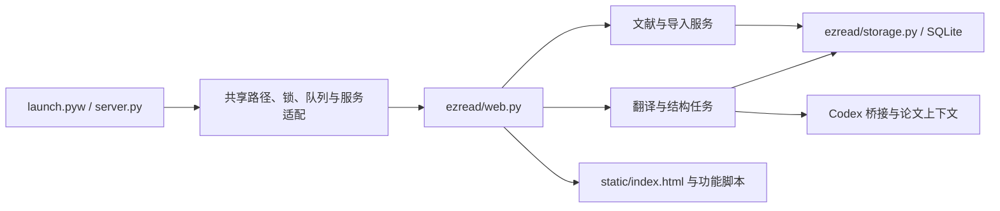

# EzRead 架构

项目采用本机 Python HTTP 服务、SQLite 和原生网页界面。用户可以让自己的编程助手直接修改源码，再刷新界面或重启后台加载改动。当前拆分保持原有 HTTP 接口、数据格式、启动方式和交互；没有新增插件系统或构建框架。

## 入口与依赖

`server.py` 是组装入口，定义每个服务实例使用的路径、锁、任务队列和默认设置，并以兼容函数委托给 `ezread/`。这些函数也是既有测试和本地脚本的调用入口。

`ezread/context.py` 定义 `ApplicationContext`：服务需要哪些共享状态与操作。运行时由入口模块提供，调用时显式传入。业务模块不导入 `server`，所以没有循环导入；测试可以注入临时路径、模拟模型调用与独立队列。当前契约保留既有全局命名，尚未把应用转换成多实例对象。

| 后端模块 | 职责 |
| --- | --- |
| `config.py` | 统一版本、环境变量、相对路径解析与旧变量只读兼容 |
| `storage.py` | 建库、连接、文献 CRUD、设置存储与重启后的任务状态恢复 |
| `preferences.py` | 设置和阅读状态的校验 |
| `library.py` | 对外文献数据、元数据、源文件操作 |
| `imports.py` | PDF 签名、哈希去重、提取、导入与失败清理 |
| `structure.py` | 整理队列、主题归类、保留手动编辑的原子提交 |
| `translations.py` | 模型快照、历史版本、草稿、重译暂存与完整提交 |
| `tasks.py` | 通用队列、取消、继续、额度暂停与连接状态缓存 |
| `web.py` | HTTP 契约、输入校验、静态资源与媒体路由 |
| `utils.py` | 无状态工具 |

`pdf_tools.py`、`paper_ai.py`、`codex_bridge.py`、`codex_models.py`、`codex_usage.py`、`journal_tiers.py` 与原生 Windows 辅助模块已各有独立职责，本轮保留原位置。`paper_structure.py` 加载随源码分发的论文导入流程。完整定位表见根目录 `AGENTS.md`。

## 前端

`index.html` 用经典 `defer` 脚本明确加载顺序；无需 npm 或打包。各文件定义函数，只有最后的 `app.js` 执行初始化。先加载的阅读器与弹窗在用户操作时调用公共函数，此时所有脚本已加载。

- `core/`：共享状态与常量、DOM、显示格式、偏好和 HTTP 请求。
- `core/storage.js`：统一 `ezread-*` 保存键，将旧缓存迁移到新键；写入失败保留旧值。
- `library/`：文献操作、筛选排序、卡片布局、多选、拖动和导入。
- `detail/`：论文简介、笔记保存、元数据和封面操作。
- `tasks/`：任务列表、连接状态和额度展示。
- `reader.js`、`paper-chat.js`、`translation-ui.js`、`settings-ui.js`：现有独立功能。
- `app.js`：绑定事件、轮询和启动。

当前是按功能分文件的经典脚本模块，仍共享状态和公共函数。新增功能应沿用 `state`、`api()`、`patchPaper()` 等公共契约，避免复制状态。没有声称完成 ES Module 封装；若未来规模需要，可逐个迁移，而不是一次重写界面。

样式按 `style`、`preferences`、`reader`、`redesign`、`surfaces` 的顺序覆盖。最后一层统一圆角与柔光。

## 数据与任务

默认数据是 `data/`，`EZREAD_DATA_DIR` 可覆盖。启动器与服务共用相同的路径解析，旧环境别名只在 `config.py` 中读取，新变量优先。数据库以 JSON 文献文档和独立的 AI 会话表存储状态，PDF 和图片使用文献 ID 子目录。清理旧名称不修改表结构、原文块 ID 或存储位置。

导入先本地提取、生成结构，再把新论文加入独立整理队列。后台提交复查源指纹、手动归属和当前合集名称，避免覆盖新编辑。翻译队列串行执行，重译分批暂存，完成后提交；取消、额度受限或失败保留可继续的结果。

HTTP 仅监听回环地址。对写请求保留 Host/Origin 校验，对静态和媒体访问保留路径约束。模型通信集中在桥接模块，本地阅读与健康检查不需要发起模型推理。

## 验证与后续扩展

`python scripts/check.py` 统一运行现有离线回归与 JS 语法检查。前端测试从 `index.html` 读取实际脚本顺序，避免拆文件后测试仍验证旧副本。GitHub Actions 在 Windows 上运行同一入口。

修改模块时直接验证其功能契约；涉及数据库时用临时库，涉及模型时模拟响应。浏览器交互、原生窗口和真实模型的验收分别记录，不用其中一种代替另一种。

本轮建立可定位、可测试的模块边界。安装包、自动更新、第三方模型接入、许可证和正式发布仍需各自独立处理。
