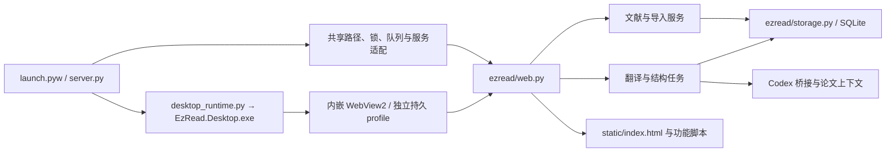

# EzRead 架构

项目采用本机 Python HTTP 服务、SQLite 和原生网页界面，Windows 启动入口使用独立 WinForms 窗口内嵌 WebView2。用户可以让自己的编程助手直接修改源码，再刷新界面或重启后台加载改动。原有 HTTP 接口、数据格式和交互保持兼容。

主窗口关闭先等待前端笔记、阅读位置、偏好和本机草稿保存，再通过绑定实例的 `/api/shutdown` 退出后台。`ezread/lifecycle.py` 取消在途选区与任务、保留重译 staging 并持久化暂停状态，停止接收新请求。模型通道通过 `ezread/processes.py` 统一登记自己的进程；后台和原生宿主各自使用 Windows Job Object，让进程退出时内核清理剩余模型／WebView2 后代。宿主绑定后台的实例 ID 和稳定进程句柄，避免 PID 重用误关其他进程；`/api/desktop-attach` 只监视当前应用目录的真实桌面 EXE，宿主异常退出也触发后台清理。启动器等待正在退出的旧实例释放端口，下一次打开创建新后台。关闭子窗口和重复启动唤醒均不退出主窗口的后台。

`scripts/verify-exit.py --executable <workspace-build>/EzRead.Desktop.exe` 在独立库中验证两轮关闭／重开、任务草稿与笔记保留、后台及模型后代退出、后台崩溃清理，以及宿主崩溃后的后台和 WebView2 清理；模型进程均为本地模拟进程。

## 入口与依赖

`server.py` 是组装入口，定义每个服务实例使用的路径、锁、任务队列和默认设置，并以兼容函数委托给 `ezread/`。这些函数也是既有测试和本地脚本的调用入口。

`ezread/context.py` 定义 `ApplicationContext`：服务需要哪些共享状态与操作。运行时由入口模块提供，调用时显式传入。业务模块不导入 `server`，所以没有循环导入；测试可以注入临时路径、模拟模型调用与独立队列。当前契约保留既有全局命名，尚未把应用转换成多实例对象。

| 后端模块 | 职责 |
| --- | --- |
| `config.py` | 统一版本、环境变量、相对路径解析与旧变量只读兼容 |
| `storage.py` | 建库、连接、文献 CRUD、设置存储与重启后的任务状态恢复 |
| `preferences.py` | 设置和阅读状态的校验 |
| `library.py` | 对外文献数据、元数据、源文件操作 |
| `imports.py` | PDF 签名、哈希去重、提取、导入与失败清理 |
| `publication.py` | 用户确认后的出版信息检索、匹配、补空与来源追踪 |
| `structure.py` | 原文整理队列、源指纹验证与原子提交，保留既有合集归属 |
| `translations.py` | 模型快照、历史版本、草稿、重译暂存与完整提交 |
| `tasks.py` | 通用队列、取消、继续、额度暂停与连接状态缓存 |
| `web.py` | HTTP 契约、输入校验、静态资源与媒体路由 |
| `journal_catalogue.py` | 个人期刊名单热加载、排序、校验、版本冲突、原子保存、历史快照和 Codex 修改预览 |
| `utils.py` | 无状态工具 |

根目录的 `pdf_tools.py`、`paper_ai.py`、`codex_bridge.py`、`codex_models.py`、`codex_usage.py`、`journal_tiers.py` 与原生 Windows 辅助模块是独立适配器；`ezread/` 中的应用服务调用这些适配器。`paper_structure.py` 加载随源码分发的论文导入流程。完整定位表见根目录 `AGENTS.md`。

## 目录边界

| 位置 | 保存内容 |
| --- | --- |
| 根目录入口与适配器 | 启动、桌面与外部能力连接，不保存历史实现副本 |
| `ezread/` | 按职责划分的后端应用服务 |
| `static/` | 当前界面脚本、样式、图标与内置期刊名单 |
| `desktop/` | 原生窗口源码与 manifest；`bin/` 是忽略的构建产物 |
| `assets/`、`skills/` | 公共资源、授权信息和随软件分发的论文导入流程 |
| `scripts/`、`tests/` | 可复用维护工具与离线回归 |
| `docs/` | 架构与开发说明 |
| `data/` | 私人论文库、阅读状态与浏览器 profile，不提交 |
| `work/`、`output/`、`.deps/` | 本机诊断、验证产物与依赖缓存，不提交 |

历史源码由 Git 和 `work/backups/` 保存；旧的一次性诊断与截图归档到 `work/archive/`，不作为当前可执行入口。旧环境变量、浏览器保存键、段落批注与草稿迁移属于有效兼容逻辑，集中保留在对应模块。

出版信息联网查询统一进入 `publication.py` 的用户确认流程；已移除未被业务调用的旧 `crossref_metadata` 函数及其入口适配。划线译文由当前选区卡片展示，不再保留旧段落内译文列表的状态和样式。旧段落编辑器只承担未保存草稿的恢复，不能与停用的段落操作栏一起删除。

## 前端

`index.html` 用经典 `defer` 脚本明确加载顺序；无需 npm 或打包。各文件定义函数，只有最后的 `app.js` 执行初始化。先加载的阅读器与弹窗在用户操作时调用公共函数，此时所有脚本已加载。

- `core/`：共享状态与常量、DOM、显示格式、偏好和 HTTP 请求。
- `core/storage.js`：统一 `ezread-*` 保存键，将旧缓存迁移到新键；写入失败保留旧值。
- `library/`：文献操作、筛选排序、卡片布局、多选、拖动和导入。
- `detail/`：论文简介、笔记保存、元数据和封面操作。
- `tasks/`：任务列表、连接状态和额度展示。
- `reader.js`、`paper-chat.js`、`translation-ui.js`、`settings-ui.js`：现有独立功能。
- `app.js`：绑定事件、轮询和启动。

当前是按功能分文件的经典脚本模块，仍共享状态和公共函数。新增功能应沿用 `state`、`api()`、`patchPaper()` 等公共契约，避免复制状态。没有声称完成 ES Module 封装；若未来规模需要，可逐个迁移，而不是一次重写界面。

`journal-catalogue-ui.js` 提供设置中的期刊等级面板；HTTP 与 CLI 共用 `ezread/journal_catalogue.py`。内置 CSV 只读作为初始值，当前 data 目录的个人 CSV 保存完整名单，按内容摘要作为 revision；写入使用跨进程锁及原子替换。公开论文每次按当前有效名单计算评级，轮询签名包含等级与身份冲突标记，让文件编辑也能更新颜色和筛选。Codex 仅生成 JSON 操作预览，验证后通过同一保存入口应用，不直接写源码或文献库。

样式按 `style`、`preferences`、`reader`、`redesign`、`surfaces` 的顺序覆盖。最后一层统一圆角与柔光。

主题仅保留纸白、浅绿和石墨，设置选择器与前端归一化共用 `THEME_CHOICES`，后端读取与校验共用 `THEMES`。数据库或浏览器缓存中的无效主题回到纸白，其他偏好照常保留；已移除主题不再保留专用样式和选择分支。

文献库固定五列，保留最短列布局。主桌面窗口通过 WebView2 页面缩放把有效 CSS 宽度保持在 1920：窗口尺寸、显示器 DPI 或页面滚动条改变时，重新测量并等比例缩放整个界面。字体、侧栏、卡片、弹窗和菜单沿用同一坐标系；高度仍按实际窗口提供滚动空间，不伸缩图片比例。原 PDF 子窗口不采用文献库缩放。`verify-desktop.py` 在临时文献库与模拟接口下核对三个窗口宽度的五列、卡片几何及侧栏一致性。

根滚动区域保留稳定的滚动条占位，设置窗口打开期间统一锁定背景滚动。切换到期刊等级及其他分类不改变背景可用宽度，不触发卡片重排或桌面缩放往返；真实期刊名单修改仍通过既有保存入口刷新评级。`verify-desktop.py --background-stability` 在长文献库中逐帧核对背景位置、滚动位置和缩放值。

`core/select.js` 为可见的单选下拉框提供侧栏同款列表，覆盖 PDF 缩放、模型、对话版本和编辑表单。保留隐藏的原生 select 作为值、表单和事件的来源，现有 `.value`、选项更新和 `change` 处理继续生效；通过偏好同步及 DOM 观察刷新显示。列表使用非模态 auto popover，支持方向键、首尾、键入查找、Esc 和点击外部关闭，不添加全局模糊。原有侧栏筛选与合集菜单保持各自的交互契约。

右下角成功、警告和错误提示统一由 `core/api.js` 管理。提示容器使用非模态的手动 popover，置于浏览器顶层；弹窗或下拉浮层打开／关闭时重新排列提示，并将其归属到当前活动弹窗，避免被 modal 遮挡或受背景 inert 限制。提示不抢焦点、不拦截点击、不新增模糊遮罩，仍按各自的时限消失。不能仅用更大的 `z-index` 修复原生 dialog 顶层遮挡。

`settings-ui.js` 提供外观与字号、期刊等级、翻译、文献与备份、关于五个设置分类。“外观与字号”在同一面板中提供主题、界面和中文阅读字号，沿用偏好自动保存并显示实际保存状态，不提供重试保存或恢复默认值按钮；阅读字号预览使用明确的示例文字。全部文字固定使用基础样式中的系统字体栈，不提供字体选择、字体映射或内置字体文件。前后端设置契约不再包含字体选项，旧数据库和浏览器缓存中的字体选项因不在设置白名单中而被忽略。同步滚动仅在阅读界面切换。DOM 工具保留 `aria-label` 等可访问性名称，不生成悬停文字。实际任务进度、保存状态、错误和论文来源信息仍在相关位置显示。悬停材质与控件反馈由 `surfaces.css` 统一定义，动画尊重系统减少动态效果设置。

“翻译”页保留原有纵向顺序和控件尺寸：全文翻译、划线翻译、连接状态、账户用量。两组翻译配置之间不显示横线，只适度减少垂直间距与卡片留白。连接与用量常驻显示，不使用折叠区；保留原有标题、用量窗口和更新时间。内容能够完整放入窗口时不显示滚动条；窗口极矮或异常内容增加时保留访问全部内容的能力，不裁切底部信息。下拉菜单通过顶层 popover 完整显示。相关样式仅作用于翻译分类，不改变其他设置页和任务窗口的布局。

“翻译”页的全文与划线翻译各自保存模型和推理强度，选择后立即更新前端并通过公共偏好队列串行保存。保存响应不能覆盖尚在等待保存的新选择，失败保留当前选择并显示重试入口。每次进入“翻译”页自动刷新一次共用模型目录、连接状态和账户用量，重复点击当前标签不重复刷新；不保留该页的三个手动刷新按钮。两组选择器同步重绘；换模型时恢复模型默认推理强度，目录刷新本身不改写用户配置。划线翻译请求从持久设置中读取自己的模型与推理强度；旧设置缺少推理强度时沿用模型默认值。官方 CLI 的 stderr 持续排空，仅保留权限、登录或网络错误类别，不保存或向界面返回原始诊断。真实服务从正常用户环境启动，不能复用继承开发沙盒限制的服务来验收模型目录或用量连接。

模型选择器每次收到共用目录状态都跟踪后台刷新的完成情况，包括由设置页直接触发的刷新。已有目录在刷新期间继续可选；两组选择器共用请求，刷新完成或窗口关闭后停止轮询，避免后台已完成但界面一直显示刷新中。刷新目录不重置用户的模型或推理选择。

编辑论文信息窗口的标题与关闭按钮在表单外固定显示，表单在圆角外框内缩的区域独立滚动；原有字段校验、保存和关闭契约继续使用。简介和出版信息核对窗口不提供发表信息来源链接，已移除对应渲染函数和专用样式，数据库中的来源记录继续保留。

## 数据与任务

论文简介由 `detail/paper.js` 渲染图文元数据、出版信息核对按钮／状态右侧的合集选择框、独立关键词组、阅读操作、全宽研究速览和其下的研究笔记；期刊等级徽标放在 DOI 右侧靠右，使用文献库图例的对应配色。简介不再显示全文翻译状态块，翻译控制与任务窗口保持原契约。`#detail-dialog` 裁切外层圆角，`#detail-scroll` 在内侧独立滚动；轮询刷新保持这个内层容器的滚动位置，切换文献从顶部显示。间距和窄窗口布局由 `surfaces.css` 的局部规则管理，窄窗口依次显示出版信息与合集，阅读按钮独占首行。合集 popover 与笔记保存沿用原契约。`scripts/verify-detail.py` 用临时文献库验证宽／窄窗口和大字号几何、徽标位置与配色、关键词与按钮间距、滚动条内缩、合集键盘操作与保存、笔记保存／重开、已核对状态保持，以及旧团队接口返回 410；不会调用真实模型。

出版信息核对使用 `checked_at`、当前缺项、冲突与错误共同判断成功，不把完整但未核对的字段当成核对结果。`publication.py` 只读恢复旧版本关闭弹窗误写 declined 的成功记录；明确拒绝联网只给尚有缺项的记录保存 declined，不撤销已经完成的核对。`publication-ui.js` 为完整记录显示可选核对说明，为已核对记录显示成功与现有信息，关闭时不重复提交拒绝或联网请求。简介用状态文字替代已完成的核对按钮；实质编辑出版字段在 `library.patch_paper_fields` 中撤销旧核对标记并保留上次时间，笔记等无关编辑不影响它。

简介不渲染期刊名单匹配说明／编辑名单入口和 PDF 页数提示；期刊名单仍在设置中管理。关键词区域使用弱分隔线及低对比圆润胶囊，沿用主题颜色变量，按可用宽度自然换行；不显示“关键词”标题。空标签时显示“生成速览以显示论文关键词”及“生成速览”按钮，复用 `runPaperTask("summarize")`，仅由用户点击触发；已有速览任务运行时显示生成提示并禁用重复提交。仅作用于简介，不改动文献库标签。

作者与团队联网查询已移除：不渲染团队面板或队列状态，不接受新的 team 任务，工作队列丢弃遗留 team 请求，Codex 适配器不再提供 research_team。历史团队字段在数据库中保留，公开文献输出不再包含这些字段；论文的作者元数据和笔记保持原有语义。

`reader-text.js` 使用原生 Selection／Range 完成文字选择，鼠标选择结束或键盘选区稳定后自动显示操作菜单，右键仍可打开菜单。菜单与批注卡片放在当前阅读弹窗的非模态 popover 顶层。菜单保持原生选区与 Ctrl+C，Esc 关闭后不会因同一选区重新弹出。CSS Custom Highlight API 绘制选区标记，不拆换文字节点。右侧 paragraph 元素保留文章结构和 PDF 来源映射，取消点击整段选中及操作条；后台刷新通过 readerIsEditing／readerTextProtected 暂停，选区释放后更新。

批注文字显示蓝色下划线。各段右侧的蓝色竖线依据该批注的 Range 行矩形定位，覆盖实际选中文字的高度；ResizeObserver 在字号与栏宽变化后更新位置。竖线是绝对定位的独立按钮，不修改正文节点。跨段批注在各段绘制竖线，引用同一记录；重叠批注共用竖线并通过列表分别查看。无法可靠定位的范围不绘制竖线，仍从待核对入口保留查看。

选区高亮支持黄色和红色，选区菜单在同一行左侧显示“高亮”，右侧提供两个可点击色块。颜色保存在标记的 color 字段。旧标记缺少颜色时继续显示黄色；两种颜色使用独立的 CSS Highlight 集合，切换语言或关闭阅读器时一并重绘／释放。

论文卡片的分类色、文字及操作按钮使用独立的局部配色，不随界面主题变化；底部分类图例与卡片保持一致。阅读高亮使用固定的不透明浅黄色／浅红色及深色文字，旧段落高亮也保留固定配色，避免在石墨主题下与深色背景混合变暗。主题仍控制侧栏、弹窗和阅读底色，不修改已保存的标记颜色。

`ezread/text_actions.py` 是选区数据与修订服务，HTTP `/api/papers/<id>/text-actions` 校验全文快照、所选引用、语言和 Unicode code point 范围后在文献锁内提交。标记包含一个 ID 和多个源块范围；引用、前后文与摘要用于保守重新定位。英文修订写 `text_override`，译文修订写既有 translation 字段，完整前后值存入 text_revision_history；撤回核对当前值，拒绝覆盖后续修改。请求 ID 防重，标记 revision 防过期覆盖，独立文献修订 token 让同一时间内的变化也能被轮询识别。旧 note／highlight 字段仍保留并以旧段落标记查看。

模型输入读取校订后的英文；校订本身不翻译。“重新翻译对应段落”按保存的划线模型配置主动执行，提交前再次检查内容和任务状态。全文重译分批保存来源摘要，新文字范围修订发生后，旧任务结果保留为草稿并拒绝覆盖；旧整段编辑的历史快照兼容行为保留。译文和原文标记使用各自的范围，重译后引用不能可靠定位时只显示待核对。

选区菜单分别提交 `translate_word` 和 `translate_sentence` 到既有 text-actions 接口；旧 `translate` 动作继续兼容句子翻译。两条路径都核对原文范围，模型输入与词典检索来自已验证的源文字，不能被客户端 selected_text 替换。查词由 `ezread/dictionary.py` 只读访问随应用分发的 ECDICT SQLite，按完整词条和词形映射查找，不要求登录、不自动回退联网。词典和真实论文库独立；保留上游授权和可重建校验记录。

句子翻译由 `selection_codex.py` 维护专用 stdio app-server，禁用无关 MCP、插件、技能、记忆与其他代理工具，保持只读沙盒及 ChatGPT 登录。`app.js` 在首页文献库加载后异步 POST `/api/selection-session`，由上下文中的 `SELECTION_SESSION`（`ezread/selection_session.py`）启动一次后台准备。请求立即返回，GET 同一路径只读取内部状态；不接受正文或客户端模型参数。准备执行通道初始化、thread/start 和一次固定短提示的 turn/start，使用保存的模型及显式推理选项（未指定时传 null，由 Codex 采用默认），不依赖模型目录刷新。提示说明这是连接测试、不是论文或术语上下文，严格输出 schema 要求固定“预热完成”回复。预热等待有效回复和成功 turn/completed，随后标记传输对象 warmed，重复准备不再发测试。准备失败不因页面刷新无限重试，正式翻译仍可继续使用对话；准备与翻译共用调用锁，等待期间仅显示通用连接准备提示，后台测试回复、诊断和重连状态不进入正式翻译界面，用户取消本轮仍保留准备。软件退出的 SHUTDOWN 事件中断准备／测试，既有进程清理释放通道。ephemeral 表示不落盘，允许在进程内连续提问。所有论文复用同一 thread 和上下文，切换文章不新建对话，软件退出统一释放，不按空闲或轮数回收。模型和推理配置随本轮显式传入；每轮用已验证的 paper_id 标识来源，提示只翻译本次 selected_text，仅同篇文章的既往轮次用于术语上下文，不把不同文章当成同一研究。完整 final-answer 到达立即显示，下一轮等待前一轮 turn/completed，避免被合并为在途轮次的追加输入。取消标记可跨迟到的 thread/start、turn/start 响应，由真实 turn_id 中断本轮，保留对话；界面调用不按固定时长自动取消。

句子翻译进度通过 `on_progress` 传递到同一窗口／请求注册表，浏览器每 500ms 查询 `/api/papers/<id>/selection-progress`，仅显示当前译文、最新状态及用时，覆盖旧输出，不渲染历史列表。等待期间有“取消翻译”按钮，用户取消只中断本轮，保留后台对话。完整译文仍通过既有 POST 返回；JSON 中 translation 字符串可随公开消息增量提前展示。stderr 经 `ezread/selection_output.py` 本地翻译常见通道提示并脱敏，不显示私有推理／请求载荷；未识别的公开错误保留脱敏原文。不写入文献库，完成请求的单条状态短时保留用于最后一次查询，沿用取消记录的有界 TTL 清理。

`ezread/selection_requests.py` 通过 ApplicationContext 注入窗口与请求取消注册表。浏览器同时使用 AbortController 和 `cancel_translation` 动作；重新选择、关闭卡片／阅读器以及语言切换均取消旧请求。注册表处理取消早于提交、旧取消晚于新请求和旧请求晚完成等乱序情形，隔离不同窗口与论文；cancel_event 传入模型 RPC 和等待循环，并向该轮次发送 turn/interrupt。返回前复查源内容，拒绝翻译期间发生的原文修订。左键松开不再自动翻译。

默认数据是 `data/`，`EZREAD_DATA_DIR` 可覆盖。启动器与服务共用相同的路径解析，旧环境别名只在 `config.py` 中读取，新变量优先。数据库以 JSON 文献文档和独立的 AI 会话表存储状态，PDF 和图片使用文献 ID 子目录。清理旧名称不修改表结构、原文块 ID 或存储位置。

导入先本地提取、生成结构，再把新论文加入独立整理队列。新论文不分配合集；合集由用户手动管理。后台只校对原文结构，提交时复查源指纹，不修改合集列表或任何既有归属；旧主题分类输出也不会被应用。翻译队列串行执行，重译分批暂存，完成后提交；取消、额度受限或失败保留可继续的结果。

出版信息识别按真实标题的多行位置定位作者，过滤版权与许可旁栏，并识别出版页脚中的日期与文章编号。用户确认联网后查询 Crossref／arXiv；明显非人名作者不作为匹配约束，合法作者冲突仍拒绝提交。检索补空时可纠正明确误识别的自动作者／期刊字段、细化同一年份的日期，保存 corrected 与字段来源；手工和并发修改始终优先，不改写源块或阅读数据。

`skills/ezread-paper-import/scripts/publication.py` 提供共享的 `title_evidence` 与 `normalize_publication`：前者按页面连续标题区域识别完整标题，后者贯通新导入、缺项判断、联网记录与公共卡片。会议类型和简称在导入或显式补全时持久保存；旧库兼容显示不触发批量数据迁移或联网。回归使用不同标题 / 版式，禁止按单篇文献身份硬编码修复。

会议页眉保存会议类型、全称与可识别简称。公开文献数据为缺失的会议简称提供括号缩写或已知名称匹配；旧 PDF 自动提取成期刊的明确会议来源只在展示层修正，不修改真实文档。卡片显示会议简称，全称保留在编辑信息中；手工简称和类型优先，未知简称提示补充。

HTTP 仅监听回环地址。对写请求保留 Host/Origin 校验，对静态和媒体访问保留路径约束。模型通信集中在桥接模块，本地阅读与健康检查不需要发起模型推理。

## 验证与后续扩展

`python scripts/check.py` 统一运行 Python 静态检查、源码发布检查、离线回归与 JS 语法检查。前端测试从 `index.html` 读取实际脚本顺序，避免拆文件后测试仍验证旧副本。GitHub Actions 在 Windows 上运行同一入口。`scripts/audit-source.py` 检查工作区内已跟踪及未忽略的新文件，避免私人数据、凭据或本机路径被误提交；它不代替 Git 历史审计。

修改模块时直接验证其功能契约；涉及数据库时用临时库，涉及模型时模拟响应。浏览器交互、原生窗口和真实模型的验收分别记录，不用其中一种代替另一种。

桌面入口是 `启动EzRead.vbs → launch.pyw → desktop_runtime.py → desktop/bin/EzRead.Desktop.exe`。EXE 内嵌 WebView2 控件，只有本机服务地址可在主窗口导航，用户点击外部网页链接时才交给默认浏览器；下载使用原生保存对话框。关闭前调用 `static/desktop.js` 等待保存，失败的本机草稿保留在 profile 中。EXE 持有任务栏书本图标，标题栏小图标透明，不再操作外部浏览器窗口。

`browser_state.py` 只读解析旧 EzRead profile 的 LevelDB 日志与表，校验校验和，按最新 sequence 和删除记录恢复当前 app localStorage；只允许精确本机 origin 与 EzRead 键前缀，迁移快照写入 `data/` 并只导入缺失值。保留旧 profile，不迁移其他网站或认证信息。

`scripts/build-desktop.ps1` 从微软 NuGet 下载并校验固定 SDK，使用 Windows 自带的 .NET Framework 编译器生成 x64 桌面组件。构建产物与下载缓存均不提交。`scripts/verify-desktop.py` 使用临时 profile 和模拟接口，对真实 WebView2 做重复启动、关闭重开、图标像素和草稿恢复检查；不调用模型或改写真实文献库。

当前仅维护源码运行方式。用户按 README 配置本机环境，通过 `启动EzRead.vbs` 或 `launch.pyw` 启动；个人定制流程见 `CONTRIBUTING.md`。文献默认保存在源码目录的 `data/`，`EZREAD_DATA_DIR` 可指定独立目录，更新源码不自动迁移或清理文献。

主项目源码与文档采用根目录 [MIT License](../LICENSE)。内置词典及第三方依赖保留各自授权文本，个人文献库和本机归档不属于公开源码。
